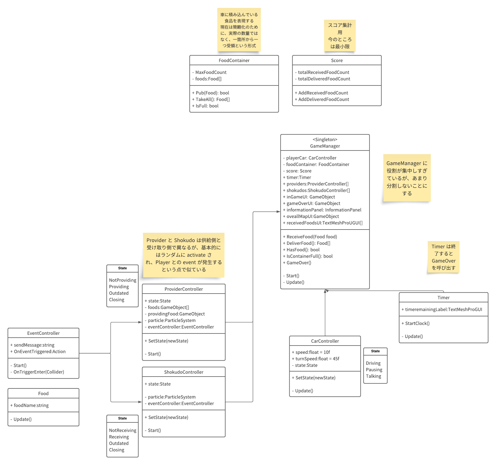

# Unity Delivery Game

this project is a sample implementation for my student.

## Prerequisite

this project depends on following plugins (free or OSS).
these plugins are not included in this repository.
Please add it to work this project. 

- Food Props
  - https://assetstore.unity.com/packages/3d/food-props-163295
- MiniMap Camera for Racing/RPG game
  - https://assetstore.unity.com/packages/3d/props/tools/minimap-camera-for-racing-rpg-game-67896
- Simple Cars Pack
  - https://assetstore.unity.com/packages/3d/vehicles/land/simple-cars-pack-97669
- SimplePoly - Town Pack
  - https://assetstore.unity.com/packages/3d/environments/simplepoly-town-pack-62400
- Fungus
  - https://github.com/snozbot/fungus/releases

## Class Diagram

